<!-- tier: full -->
# Diagrams: Resource lifecycle MVP — inbox → resources ingestion

> Part of [index](index.md) · Define

## Impact map

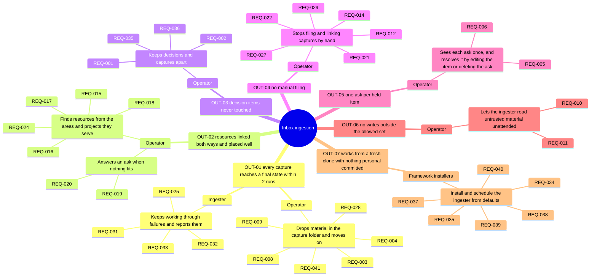

## Context diagram

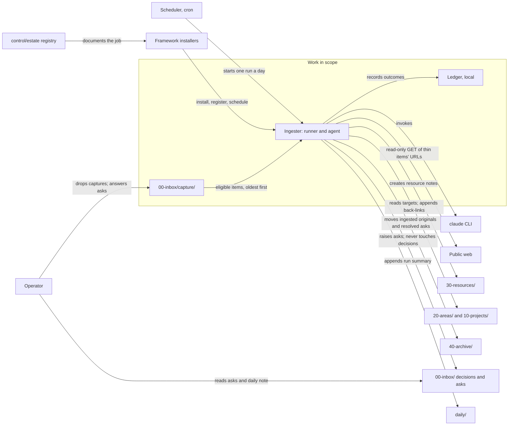

## Traceability

Split into one diagram per outcome, plus one for requirements that serve a need alone. Colour shows priority.

**OUT-01**

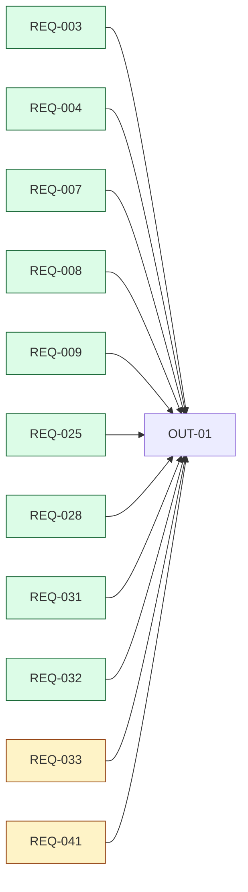

**OUT-02**

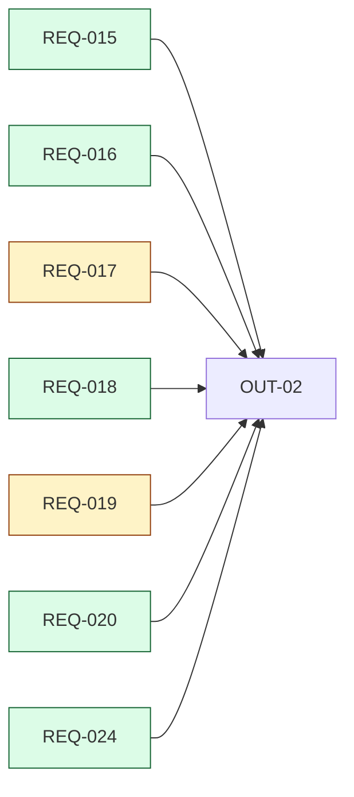

**OUT-03**

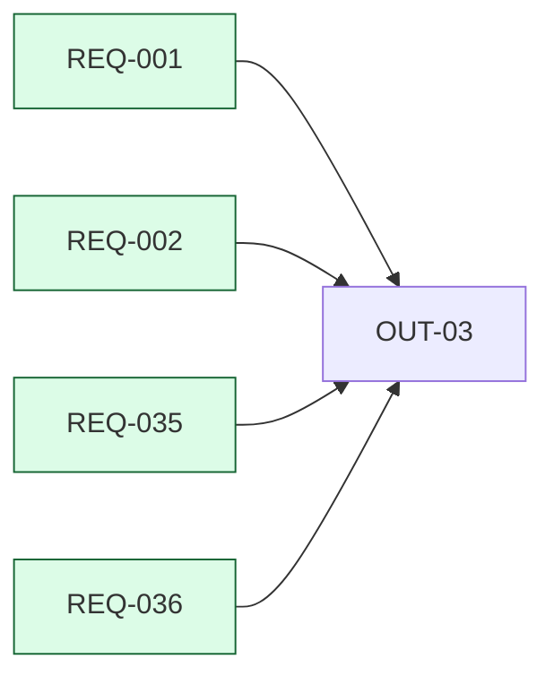

**OUT-04**

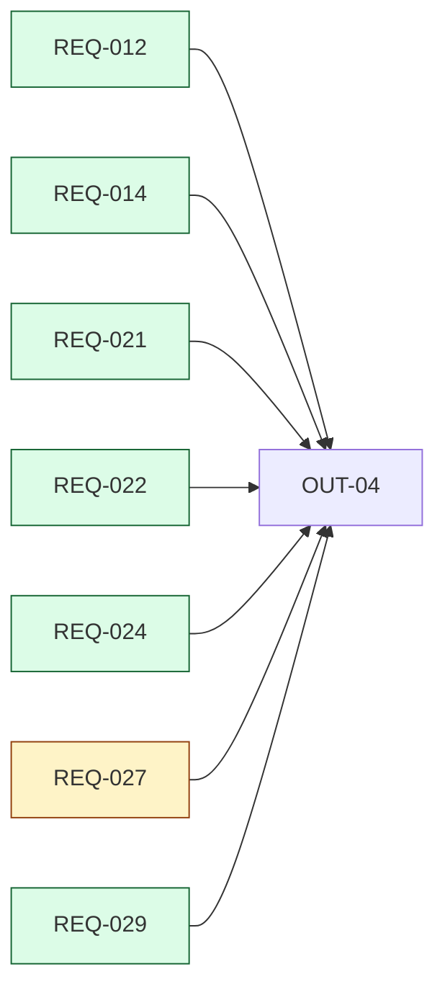

**OUT-05**

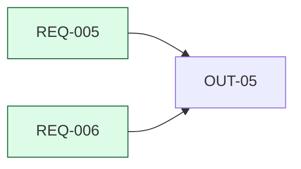

**OUT-06**

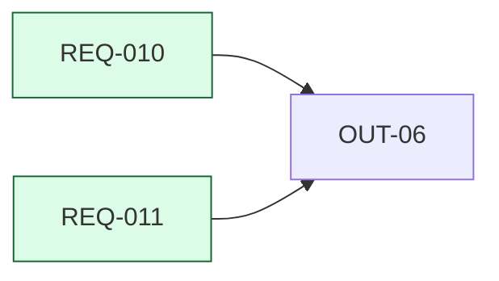

**OUT-07**

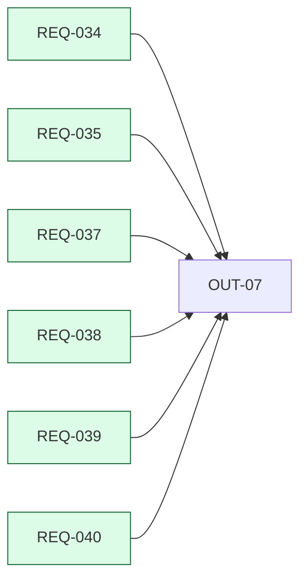

**Requirements that also or only serve a need**

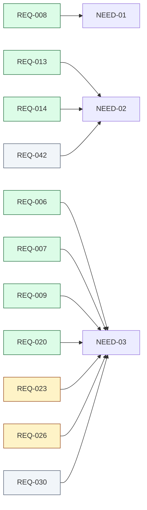

## As-is and to-be

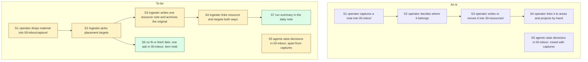
