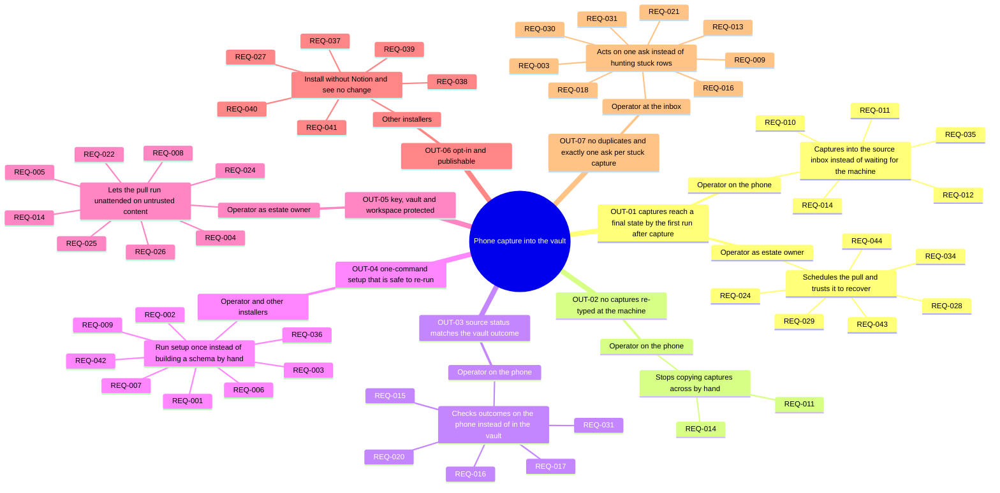
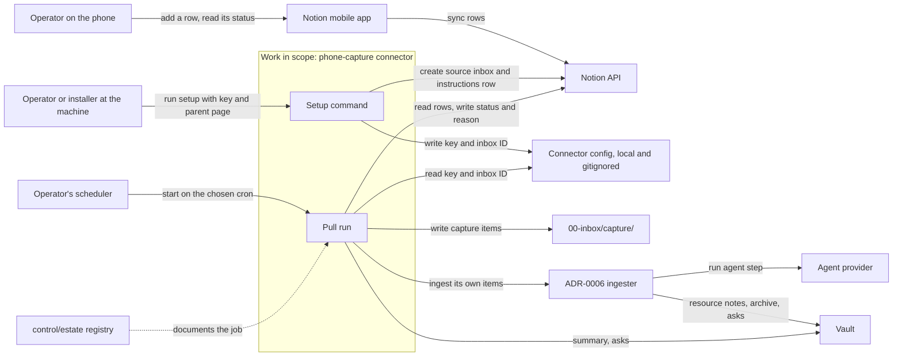
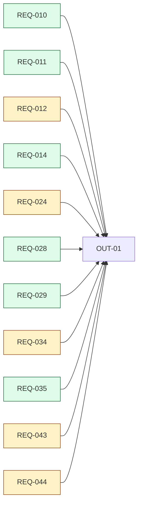
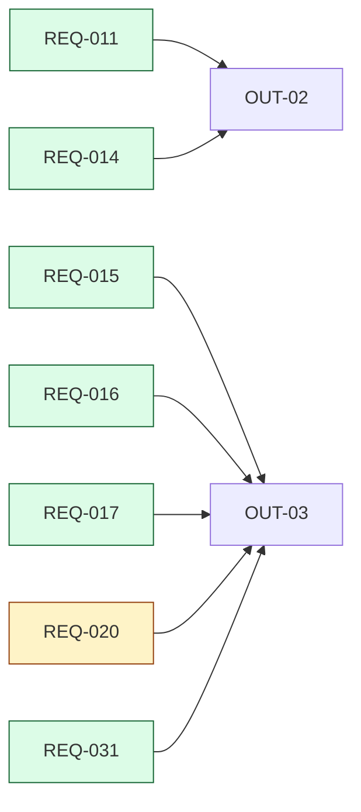
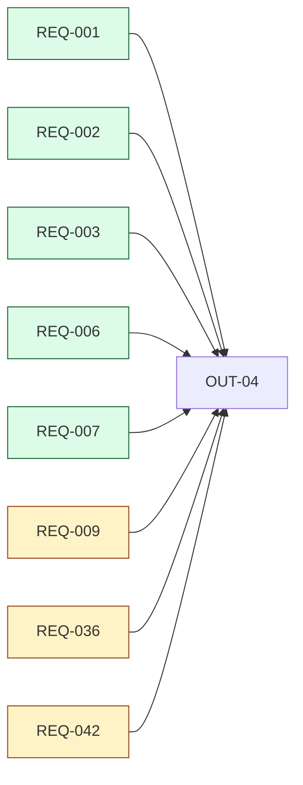
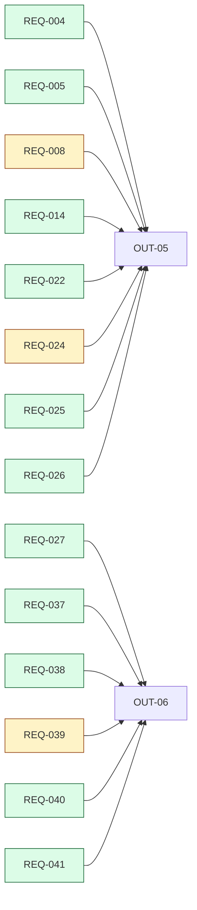
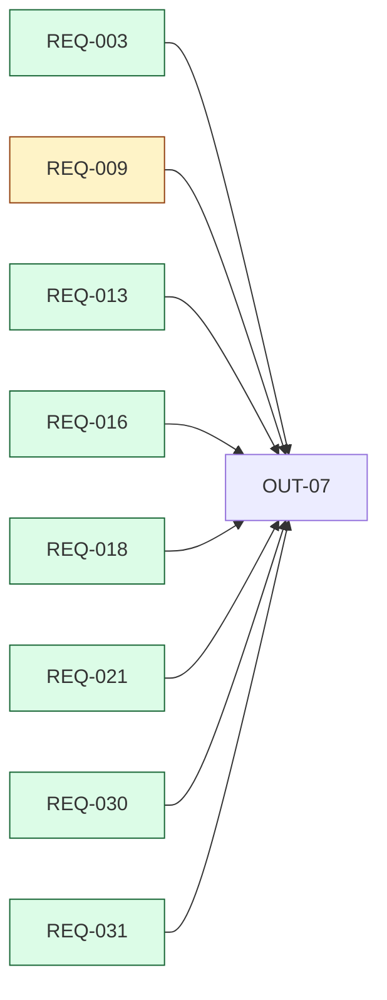
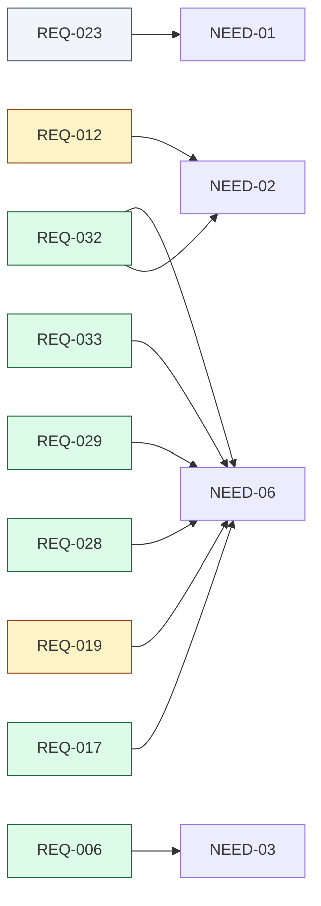

<!-- tier: full -->
# Diagrams: Notion inbox: capture from phone into the vault inbox

> Part of [index](index.md) · Define

## Impact map

## Context diagram

## Traceability

There are many requirements and many-to-many Serves links, so this uses `flowchart LR`, coloured by priority, split per outcome. Requirements that serve a need alone, or a need as well as an outcome, are drawn in the last diagram.

## As-is and to-be

The same step IDs in both. The manual transfer at the machine is removed, capture moves to the phone, and the status write-back is new.

```mermaid
flowchart TD
  classDef changed fill:#FEF3C7,stroke:#92400E
  classDef new fill:#DCFCE7,stroke:#166534
  classDef removed fill:#FEE2E2,stroke:#991B1B
  subgraph ASIS["As-is"]
    A1["S1 operator finds something worth keeping, away from the machine"] --> A2["S2 operator keeps it somewhere else or tries to remember it"]
    A2 --> A3["S3 operator opens an editor on the vault machine"]:::removed
    A3 --> A4["S4 operator writes a file into the capture folder"]
    A4 --> A5["S5 daily ingester run makes a linked resource note"]
  end
  subgraph TOBE["To-be"]
    B1["S1 operator finds something worth keeping, away from the machine"] --> B2["S2 operator adds a row to the source inbox on the phone"]:::changed
    B2 --> B4["S4 scheduled pull run writes the row into the capture folder"]:::changed
    B4 --> B5["S5 same pull run ingests it into a linked resource note"]:::changed
    B5 --> B6["S6 pull run sets the row to Ingested, or Failed with a reason"]:::new
  end
```

